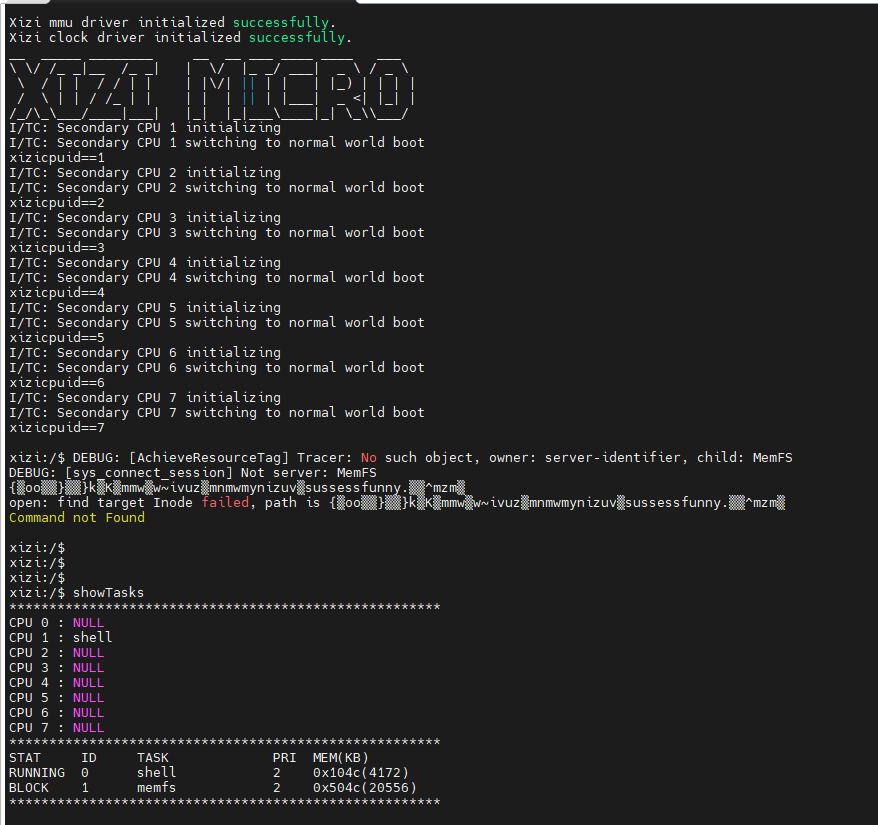

# RK3588开发板适配指南

## 1. 开发环境搭建

### 1.1 编译环境配置

#### Ubuntu 20.04 系统配置

推荐使用Ubuntu 20.04系统，首先需要更新软件源并升级系统软件：

```bash
sudo apt-get update
sudo apt-get upgrade
```

安装必要的依赖包：

```bash
sudo apt install build-essential pkg-config git
sudo apt install gcc make libncurses5-dev openssl libssl-dev bison flex libelf-dev autoconf libtool gperf libc6-dev gcc-aarch64-none-elf
```

#### RK3588编译配置

在微内核系统中，RK3588的编译环境配置如下：

- **交叉编译工具链**：`aarch64-none-elf-`
- **架构特性**：针对Cortex-A76/A55进行了优化
- **编译标志**：包含必要的ARM64架构支持和优化选项
我们目前只针对如下版本（10.3.1）的aarch-none-elf-gcc进行编译测试，如下图所示


### 1.2 SDK获取方式

RK3588完整的SDK开发资料可通过以下repo命令获取：

```bash
repo init --repo-url ssh://git@www.rockchip.com.cn/repo/rk/tools/repo -u ssh://git@www.rockchip.com.cn/linux/rockchip/platform/manifests -b linux -m rk3588_linux5.10_release.xml
```

请注意，获取SDK前需要先与瑞芯微工作人员协商获取SSH密钥授权，以确保能够正常访问代码仓库。获取密钥后，执行上述命令即可下载完整的RK3568 SDK开发资料。若未与瑞芯微协商，可通过 https://www.t-firefly.com/index.php/doc/download/239.html 获取下载，我们不保证开源版本的稳定性。

## 2. RK3588处理器硬件架构

### 2.1 基本规格

RK3588是瑞芯微(Rockchip)推出的一款高性能处理器，主要面向人工智能计算和边缘计算领域。其主要特点包括：

- **CPU架构**：八核处理器，包含四核Cortex-A76（主频最高可达2.4GHz）和四核Cortex-A55（主频最高可达1.8GHz）
- **指令集**：ARMv8-A 64位架构
- **制程工艺**：采用先进的制程工艺，提供优秀的性能功耗比
- **内存支持**：支持LPDDR4X内存，支持16GB内存容量，提供高速内存访问能力
- **Flash支持**：使用eMMC芯片FEMDNN128G存储
- **应用场景**：适用于边缘计算、AI加速、高端智能终端、数字标牌、工业控制等多种行业应用

### 2.2 主要外设接口

RK3588处理器拥有丰富的外设接口，包括：

- 多网口支持（2.5G/1G）
- 双CAN总线接口
- 多路串口（最多支持8路）
- PCIe 3.0接口
- HDMI 2.1/DP接口
- 其他丰富的工业控制接口

## 3. 微内核适配情况

### 3.1 已实现的适配功能

目前，微内核与RK3588的适配已实现以下核心功能：

#### 3.1.1 系统调用接口

- 通过ARM64架构的`svc #0`指令实现系统调用
- 支持标准的系统调用参数传递和返回值处理
- 实现了`syscall()`和`syscall_ori()`两个系统调用函数接口

#### 3.1.2 串口通信

- 配置了UART基地址为`0xfe660000`
- 实现了基本的串口初始化、发送(`putc`)和接收(`getc`)功能
- 支持标准的NS16550串口驱动协议

#### 3.1.3 硬件抽象层

- 提供了基础的硬件抽象接口
- 实现了必要的内存访问宏定义

## 4. 目录结构

`3588-board`目录包含以下主要文件：

```
3588-board/
├── Makefile        # 编译配置文件
├── arch_usyscall.c # 系统调用实现
├── libserial.c     # 串口通信库
└── stub.c          # 存根函数
```

### 4.1 文件功能说明

- **Makefile**：定义了RK3588的编译选项、工具链配置和依赖关系
- **arch_usyscall.c**：实现ARM64架构下的系统调用接口
- **libserial.c**：实现基于NS16550协议的串口通信功能
- **stub.c**：提供必要的存根函数支持

## 5. 适配细节

### 5.1 内存访问

- 使用了`out_le32()`和`in_le32()`宏进行内存映射IO操作
- 支持按位移的寄存器访问方式

### 5.2 UART配置

- UART基地址：`0xfe660000`
- 支持FIFO使能、收发缓冲区重置等功能
- 默认配置为8位数据位、无校验、1位停止位(8N1)

## 6. 使用说明

### 6.1 编译方法

在编译微内核应用时，指定`BOARD=3588`参数即可使用RK3588的适配配置：

```bash
make BOARD=3588
```

### 6.2 烧录启动

#### 6.2.1 准备启动镜像

编译完成后，会在根目录的`build`文件夹下生成`RK3588.bin`文件。需要将此文件复制到TF卡中：

1. 将TF卡插入电脑
2. 使用以下命令将编译好的二进制文件复制到TF卡根目录：
   ```bash
   cp build/RK3588.bin /media/[用户名]/[TF卡挂载点]/XiZi-3588.bin
   ```
3. 安全弹出TF卡

#### 6.2.2 U-Boot启动配置

为了确保系统能够正确启动，我们需要特定的u-boot代码.
u-boot版本号：2017.09-23.510
3588 u-boot获取方式：git clone https://gitlink.org.cn/xuos/3588_uboot.git
下载u-boot后，替换掉SDK的原始u-boot。
我们在gitlink开源的u-boot相比原来做了如下改动

1. 在`u-boot/common/main.c`文件中的`main_loop`函数应如下所示：
   ```c
   void main_loop(void) 
    { 
     	 const char *s; 
    
     	 bootstage_mark_name(BOOTSTAGE_ID_MAIN_LOOP, "main_loop"); 
    
    #ifdef CONFIG_VERSION_VARIABLE 
     	 env_set("ver", version_string);  /* set version variable */ 
    #endif /* CONFIG_VERSION_VARIABLE */ 
    
     	 cli_init(); 
    
     	 run_preboot_environment_command(); 
     	 s = bootdelay_process(); 
     	 if (cli_process_fdt(&s)) 
      	 cli_secure_boot_cmd(s); 
      
     	 s= "ext2load mmc 1 10000000 XiZi-3588.bin;go 10000000;"; 
     	 autoboot_command(s); 
    
     	 cli_loop(); 
     	 panic("No CLI available"); 
    }
   ```
   我们添加了s= "ext2load mmc 1 10000000 XiZi-3588.bin;go 10000000;"; 该修改确保CPU 0主核能够从TF卡加载并执行XiZi-3588.bin镜像。

2. 在`board_f.c`文件的`init_sequence_f[]`函数数组中，在`reserve_mmu`函数后面添加`go_xizi`函数：
   ```c
   reserve_mmu,
   go_xizi,
   ```
   这将确保从核能够正确启动。

3. `go_xizi`函数的具体定义如下，用于支持从核启动：
   ```c
   int go_xizi(void){
       func f = (void*)0x10000000;
       if(get_cpuid() != 0){
           enable_caches();
           f();
       }
       return 0;
   }
   ```
   该函数的工作原理：
   - 获取当前CPU核心ID
   - 对于非主核(CPU 0)，启用缓存并跳转到0x10000000地址执行代码
   - 这确保了从核能够正确启动并执行XiZi微内核代码
   - 函数需要在board_f.c中定义，并且需要包含相关的头文件以支持func类型、get_cpuid()和enable_caches()函数

4. 修改完u-boot后，即可编译SDK，在RK瑞芯微给的SDK根目录下执行以下步骤：
   ```bash
   ./build.sh uboot
   ./build.sh updateimg
   ```
   选择配置文件`xiuos_rk3588_xihuitong_pro_defconfig`，即可完成编译。编译完成后，在`rockdev`目录下取出`update.img`，使用瑞芯微提供的开发工具根据官方文档进行烧录。

#### 6.2.3 硬件启动

1. 将TF卡插入RK3588开发板的TF卡槽
2. 给开发板上电，系统将从TF卡启动

## 7. hardkernel适配详情

hardkernel是微内核系统中负责硬件抽象和底层驱动的核心组件，为RK3588提供了全面的硬件支持。

### 7.1 适配目录结构

hardkernel中与RK3588相关的适配文件主要分布在以下目录：

```
hardkernel/
├── arch/arm/armv8-a/cortex-a55/preboot_for_3588/    # 引导和初始化
├── uart/arm/armv8-a/cortex-a55/uart_io_for_3588/   # UART驱动
├── clock/arm/armv8-a/cortex-a55/3588/              # 时钟配置
├── intr/arm/armv8-a/cortex-a55/3588/               # 中断处理
└── mmu/arm/armv8-a/cortex-a55/3588/                # 内存管理单元配置
```

### 7.2 核心适配功能

#### 7.2.1 引导初始化

- 实现在`boot.S`中，包含EL2到EL1的切换
- 配置CPU核心、栈初始化和异常处理设置
- 支持多核心启动，区分主CPU和从CPU的初始化路径

**uboot启动XiZi_AIoT微内核操作系统的过程如下：**

1. **CPU0启动阶段**：
   - uboot首先启动CPU0（主核心）
   - 从TF卡加载XiZi微内核到内存地址`0x10000000`
   - XiZi微内核接管CPU0控制权，开始初始化过程
   
   ```c
   s= "ext2load mmc 1 10000000 XiZi-3588.bin;go 10000000;";
	autoboot_command(s);
   ```

2. **内核初始化阶段**：
   - XiZi微内核继续初始化CPU0，主要完成hardkernel（硬件抽象层）初始化
   - 随后初始化softkernel（核心功能层），建立系统基础架构

3. **从核启动阶段**：
   - XiZi微内核通过PSCI（电源状态协调接口）协议启动从核
   ```c
   void cpu_start_secondary(uint8_t cpu_id)
   {
      __invoke_sip_fn_smc(PSCI_CPUON, cpu_id, (uintptr_t)0x200000, 0);
   }
   ```
   - 从核程序起点0x200000为uboot存放位置
   - uboot负责从核的初始启动，随后将控制权交给微内核

4. **多核运行状态**：
   - 完成初始化后，所有核心进入微内核调度管理，实现多核并行运行
   - 通过这种方式，充分利用RK3588的八核处理能力

   以下图片展示了RK3568 XiZi_AIoT成功启动四核的运行状态：
   
   
   

#### 7.2.2 UART驱动

- 基于标准NS16550协议实现
- UART基地址配置为`0xfe660000`
- 实现了基本的串口初始化(`uartinit`)、发送(`uartputc`)和接收(`uartgetc`)功能
- 支持波特率配置（默认配置为高速波特率）

#### 7.2.3 时钟管理

- 基于ARM通用定时器实现
- 配置了1ms间隔的定时器中断
- 实现了时钟初始化、使能、禁用和重载功能
- 提供时间戳和秒级时间获取接口

#### 7.2.4 中断控制

- 支持GICv3中断控制器
- 实现了异常处理和陷阱机制
- 包含中断号定义和中断处理函数

#### 7.2.5 内存管理

- 提供内存布局定义(`memlayout.h`)
- 支持虚拟内存空间管理
- 实现了页表操作和内存属性配置

## 8. softkernel适配详情

softkernel是微内核系统的核心实现层，提供了平台无关的系统功能支持。

### 8.1 适配特点

- **通用微内核架构**：softkernel不直接包含硬件特定代码，采用平台无关的设计
- **资源标签系统**：通过资源标签机制与hardkernel进行交互，实现硬件抽象隔离
- **模块化设计**：包含任务管理、内存管理、IPC通信等核心功能模块

### 8.2 核心功能

#### 8.2.1 任务管理
- 实现任务创建、调度和状态管理
- 支持多任务并发执行

#### 8.2.2 内存管理
- 提供伙伴系统和对象分配器
- 支持内存空间隔离和保护

#### 8.2.3 系统调用
- 提供标准的系统调用接口
- 实现系统调用分发和处理

#### 8.2.4 资源管理
- 通过资源标签系统管理硬件资源访问权限
- 实现资源的创建、获取和释放机制

### 8.3 与hardkernel的交互

softkernel通过以下方式与hardkernel进行交互：
- 通过资源标签(`TraceTag`)获取硬件驱动服务
- 调用hardkernel提供的初始化函数设置系统环境
- 依赖hardkernel提供的底层硬件访问接口

## 9. 后续优化方向

- 完善更多外设的驱动支持
- 优化性能和功耗
- 添加更多平台特定功能
- 增强多核心调度能力
- 完善内存管理和缓存优化
- 充分利用RK3588的AI计算能力

---

*本适配指南提供了RK3588处理器与微内核系统的完整适配信息，包括hardkernel和softkernel的详细适配情况，可根据实际应用需求进行进一步的开发和优化。*