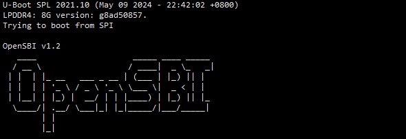
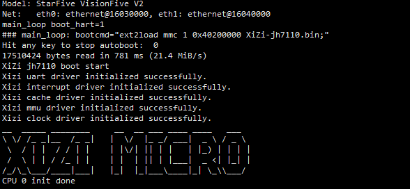

# 从零开始构建矽璓微内核操作系统：RISC-V架构StarFive开发板

[XiUOS](http://xuos.io/) (X Industrial Ubiquitous Operating System) 矽璓XiUOS是一款面向智慧车间的工业物联网操作系统，主要由一个极简的微型实时操作系统内核和其上的工业物联框架构成，通过高效管理工业物联网设备、支撑工业物联应用，在生产车间内实现智能化的“感知环境、联网传输、知悉识别、控制调整”，促进以工业设备和工业控制系统为核心的人、机、物深度互联，帮助提升生产线的数字化和智能化水平。

## 开发环境搭建

### 推荐使用：

**操作系统：** ubuntu20.04 [https://ubuntu.com/download/desktop](https://ubuntu.com/download/desktop)

### 依赖包安装：

```
$ sudo apt install build-essential pkg-config
$ sudo apt install gcc make libncurses5-dev openssl libssl-dev bison flex libelf-dev autoconf libtool gperf libc6-dev  git
```

### 源码下载：

下载矽璓源码，并切换分支prepare_for_master，命令如下：

```c
git clone https://gitlink.org.cn/xuos/xiuos.git
git checkout prepare_for_master
```

1、打开XiUOS源码文件包可以看到以下目录：

| 名称          | 说明                                                         |
| ------------- | ------------------------------------------------------------ |
| APP_Framework | 应用代码。                                                   |
| Ubiquitous    | 板级支持包，支持NuttX、RT-Thread、XiZi_IIoT和XiZi_AIoT_Micro。 |


2、打开XiZi_AIoT_Micro微内核源码文件包，可以看到以下目录：

| 名称 | 说明 |
| -- | -- |
| hardkernel | 负责硬件相关的初始化，如时钟驱动、中断处理等底层硬件管理，为上层软内核提供硬件支持。 |
| softkernel | 微内核核心功能实现，如任务管理、内存管理、进程间通信等。 |
| services | 各类服务和应用模块。其中，boards针对不同硬件板卡的适配代码。 |
| support | 辅助支持代码 |
| Makefile | 构建脚本，支持多架构（ARM、RISC-V）和不同板卡的编译配置。 |


# 赛昉科技StarFive开发板

## 1. 微处理器简介

| 硬件 | 描述 |
| -- | -- |
|芯片型号| JH7110 |
|CPU| RISC-V 四核64位RV64GC |
|主频| 1.5 GHz |
|内存| 8GB |
|存储| 16MB+TF卡 |
| 外设 | 目前仅支持UART调试 |

## 2. 编译说明

下载RISC-V交叉编译工具链：

`riscv64-unknown-elf-gcc`，链接：https://pan.baidu.com/s/1H1WQjQGLlT-xfg3-HWCu3Q 提取码：w2wn

下载 riscv64-elf-ubuntu-20.04-nightly-2023.01.31-nightly.tar.gz，并解压到Ubuntu电脑，假设解压路径是`/home/data/riscv`。

在Ubuntu环境的文件`~/.bashrc`中，添加环境变量：

`PATH="/home/data/riscv/riscv64-elf-ubuntu-20.04-nightly-2023.01.31-nightly/bin:$PATH"`

编译步骤：

1.在Ubiquitous/XiZi_AIoT目录下执行命令：

```c
make distclean
make BOARD=jh7110
```

2.如果编译正确无误，会在build文件夹下生成文件：

```c
XiZi-jh7110.bin
```

## 3. SD卡镜像

SD卡格式需要格式为ext2格式。将SD卡插到Ubuntu电脑上（或Windows电脑的虚拟机中的Ubuntu系统），假设创建的节点是`/dev/sdb`，执行命令：

`mkfs.ext2 /dev/sdb`

然后，将`XiZi-jh7110.bin`拷贝到SD卡根目录。

## 4. 开发板连线

StarFive开发板硬件介绍，可查看官网资料：https://doc.rvspace.org/VisionFive2/Quick_Start_Guide/VisionFive2_QSG/hardware_overview.html；

查看官网资料的产品框图和Pin图。

开发板通过type-c端口供电。

开发板调试串口在40-Pin GPIO 上，需要跳线连接。串口波特率（baud rate）设置为115,200。

```c
Pin6 GND
Pin8 GPIO5 (UART TX)
Pin10 GPIO6 (UART RX)
```


## 5. Uboot适配XiZi

矽璓微内核的启动依赖于Uboot。下面介绍StarFive开发板Uboot代码获取、编译和烧录。

StarFive开发板软件技术参考手册，可查看官网资料：https://doc.rvspace.org/VisionFive2/SW_TRM/VisionFive2_SW_TRM/compiling_u-boot_and_kernel%20-%20vf2.html；

主要包括以下部分：设置编译环境、编译U-Boot（包含下载源代码）、创建SPL文件、编译OpenSBI、创建fw_payload文件。

StarFive开发板更新Flash中的SPL和U-Boot，可查看官网资料：https://doc.rvspace.org/VisionFive2/Quick_Start_Guide/VisionFive2_SDK_QSG/updating_spl_and_u_boot%20-%20vf2.html；

建议采用资料中的方法一：通过tftpboot命令更新SPL和U-Boot。

为了方便管理Uboot适配XiZi的代码，我们基于StarFive官方提供的Uboot代码，创建了JH7110 Project仓库。

下载JH7110 Project仓库下的分支uboot_xizi代码，命令如下：

```c
git clone -b uboot_xizi https://gitlink.org.cn/xuos/jh7110_project.git
```

uboot_xizi 主要修改：在Uboot的函数`main_loop`中，将原来启动Linux的命令替换为从SD卡加载`XiZi-jh7110.bin`并启动的命令。


建议使用JH7110 Project仓库的uboot_xizi分支的最新代码。

重新编译烧录Uboot。详细步骤，可查看前面提到的官方资料，也可参考uboot_xizi目录下的文档`JH7110个人学习手册.docx`。

## 6. XiZi启动

将带有`XiZi-jh7110.bin`的SD卡插到开发板上。

开发板上电，将会在串口终端上看到打印。

Uboot启动的日志：



Uboot加载xizi的日志：



输入命令查看内存、cpu、任务等信息。

```c
showMemInfo
showCpusInfo
showTasks
```


## 7. 其他

内存分布以及虚拟地址映射。


