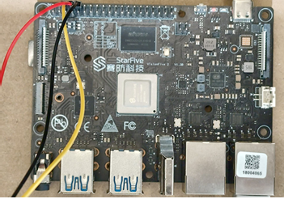
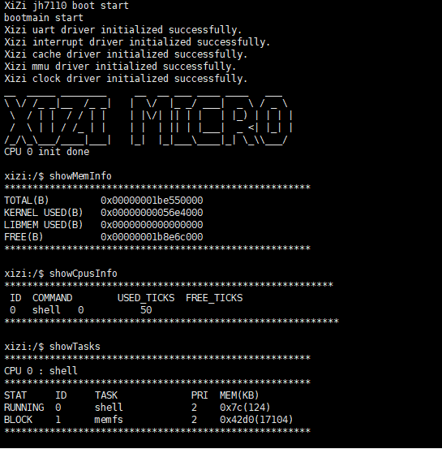

# 从零开始构建矽璓微内核操作系统：risc-v架构StarFive开发板

[XiUOS](http://xuos.io/) (X Industrial Ubiquitous Operating System) 矽璓XiUOS是一款面向智慧车间的工业物联网操作系统，主要由一个极简的微型实时操作系统内核和其上的工业物联框架构成，通过高效管理工业物联网设备、支撑工业物联应用，在生产车间内实现智能化的“感知环境、联网传输、知悉识别、控制调整”，促进以工业设备和工业控制系统为核心的人、机、物深度互联，帮助提升生产线的数字化和智能化水平。

## 开发环境搭建

### 推荐使用：

**操作系统：** ubuntu20.04 [https://ubuntu.com/download/desktop](https://ubuntu.com/download/desktop)

### 依赖包安装：

```
$ sudo apt install build-essential pkg-config
$ sudo apt install gcc make libncurses5-dev openssl libssl-dev bison flex libelf-dev autoconf libtool gperf libc6-dev  git
```

### 源码下载：

下载源码，并切换分支prepare_for_master，命令如下：

```c
git clone https://gitlink.org.cn/xuos/xiuos.git
git checkout prepare_for_master
```

1、打开XiUOS源码文件包可以看到以下目录：

| 名称          | 说明                                                         |
| ------------- | ------------------------------------------------------------ |
| APP_Framework | 应用代码。                                                   |
| Ubiquitous    | 板级支持包，支持NuttX、RT-Thread、XiZi_IIoT和XiZi_AIoT_Micro。 |


2、打开XiZi_AIoT_Micro微内核源码文件包，可以看到以下目录：

| 名称 | 说明 |
| -- | -- |
| hardkernel | 负责硬件相关的初始化，如时钟驱动、中断处理等底层硬件管理，为上层软内核提供硬件支持。 |
| softkernel | 微内核核心功能实现，如任务管理、内存管理、进程间通信等。 |
| services | 各类服务和应用模块。其中，boards针对不同硬件板卡的适配代码。 |
| support | 辅助支持代码 |
| Makefile | 构建脚本，支持多架构（ARM、RISC-V）和不同板卡的编译配置。 |


# StarFive开发板

## 1. 微处理器简介

| 硬件 | 描述 |
| -- | -- |
|芯片型号| JH7110 |
|CPU| RISC-V 四核64位RV64GC |
|主频| 1.5 GHz |
|内存| 8GB |
|存储| 16MB+TF卡 |
| 外设 | UART |

## 2. 编译说明

编译工具链：

`riscv64-unknown-elf-`

编译步骤：

1.在Ubiquitous/XiZi_AIoT目录下执行命令：

```c
make distclean
make BOARD=jh7110
```

2.如果编译正确无误，会在build文件夹下生成文件：

```c
XiZi-jh7110.bin
```

## 3. SD卡镜像

SD卡格式需要格式为ext2格式。将SD卡插到Ubuntu电脑上，假设创建的节点是/dev/sdb，执行命令：

`mkfs.ext2 /dev/sdb`

然后，将XiZi-jh7110.bin拷贝到SD卡根目录。

## 4. 启动

开发板串口在40-Pin GPIO 上，需要跳线连接。串口波特率（baud rate）设置为115,200。

```c
Pin6 GND
Pin8 GPIO5 (UART TX)
Pin10 GPIO6 (UART RX)
```



将烧录好XiZi-jh7110.bin镜像的SD卡插入到开发板。

设备上电，将会在串口终端上看到信息打印输出。输入命令查看内存、cpu、任务等信息。

```c
showMemInfo
showCpusInfo
showTasks
```



## 5. 内存分布

内存分布以及虚拟地址映射。


## 6. uboot适配

uboot源码下载，并切换分支uboot_xizi，命令如下：

```c
git clone https://gitlink.org.cn/xuos/jh7110_project.git
git checkout uboot_xizi
```

JH7110的编译烧录详细步骤，查看uboot_xizi目录下的文档：

```
JH7110个人学习手册.docx
```

查看文档中的U-Boot和SPL部分：

```
1.2. 编译U-Boot和SPL
2.3. 更新U-Boot和SPL
```
